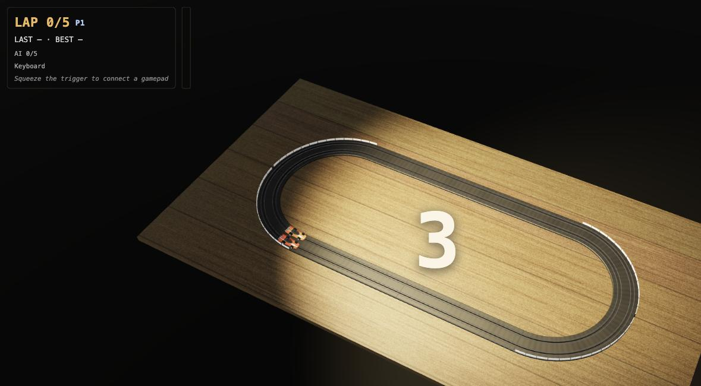
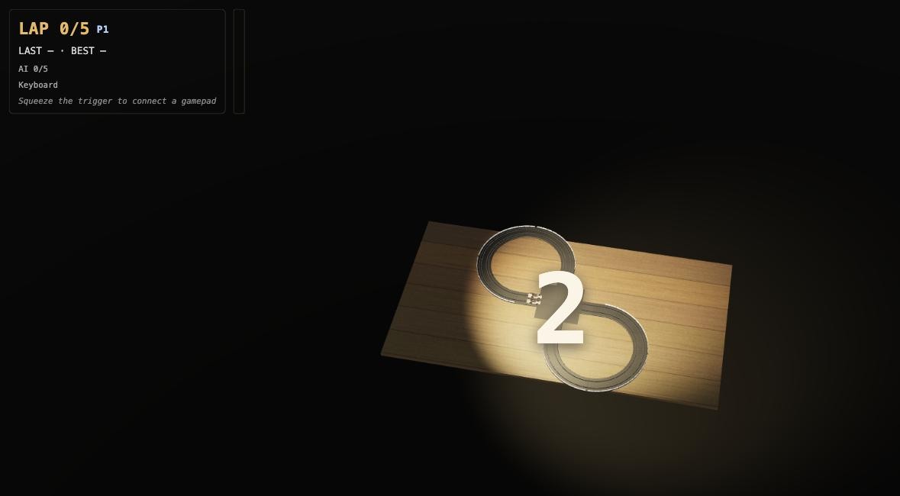

# AFX Slot Car Simulator

A photorealistic, browser-based simulation of 1970s Aurora AFX HO-scale slot car racing — the basement figure-eight, the pistol-grip trigger, the car that flies off when you overcook a corner. This is a proof of concept: solo time-trial play plus a computer-controlled opponent, built on Three.js with a custom deterministic physics core (no physics engine — slot cars are 1-DOF-on-a-path). Ships as a fully static build.

## Features

- Three track layouts — Classic Oval, a criss-cross Figure Eight, and the banked **Daytona Sweep** speedway — built from authentic AFX track-piece primitives, with two independent lanes.
- Drivable cars: authentic AFX motor/brake response curve, cornering and deslot physics (slide, tumble, re-slot), procedural 1970s AFX-style bodies, liveries, chrome, and tinted canopies.
- Banked curves and elevation that do real work: a banked corner genuinely raises the speed you can carry (gravity helps hold the car in — a 30° bank lifts the 9″ inner-lane deslot speed from ~1.5 to ~2.0 m/s), and a hill genuinely slows the climb and speeds the descent. The AI and the coach both plan against the same banked/graded limits.
- Fully synthesized WebAudio motor sound (no samples), pitch-mapped to speed.
- An AI opponent with adjustable difficulty, and a full race mode with lap timing (plus a solo Time Trial mode).
- Gamepad (analog trigger, with an auto-calibration wizard and rumble) and keyboard input — see [Controls](#controls) below.
- A top-center stats bar (current speed plus its HO 1:64 scale-equivalent mph, session lap and crash tallies, rolling FPS, and the fixed 120 Hz sim tick rate), shown alongside the HUD while a race/practice/time-trial session is live.
- Three camera views — a fitted **Table** overhead, a damped **Chase** cam, and a true first-person **Cockpit** (`C` to cycle). On the banked Daytona Sweep the cockpit horizon rolls into the 30° banking and pitches over the climb. Cockpit runs at ½× speed by default (`T` toggles full speed) — slow-motion of the wall clock only, so lap times stay honest. See [Controls](#controls) below.
- Instant replay — see that tumble again: `R` freezes the world and replays the last ~3 seconds at half speed, camera fully free to zoom/pan around it. See [Controls](#controls) below.
- A photoreal rendering pipeline: ACES filmic tone mapping, image-based lighting from a room environment map, a warm key light, and an auto quality ladder that steps rendering quality down under sustained load and back up once it recovers.
- Fixed-timestep (120 Hz) deterministic simulation core with hidden-tab-safe pause/resume.
- A mechanically-enforced architecture rule: the simulation core (`src/sim/`, `src/config/`) is pure TypeScript, guarded by a test that fails if it ever imports Three.js, touches the DOM, or calls `Math.random`/`Date.now`.

This is a proof of concept, not a finished commercial game. See the [design doc](docs/2026-07-17-slotcar-sim-design.md) for the full architecture and milestone plan, and [ROADMAP.md](ROADMAP.md) for post-POC direction.

| Classic Oval | Figure Eight |
| --- | --- |
|  |  |

## Controls

- **Gamepad** (preferred whenever one is connected): the analog trigger is throttle. The first time an unfamiliar controller is used, a 5-second calibration wizard runs automatically ("SQUEEZE AND RELEASE THE TRIGGER") to find and measure its active control; the result is remembered (`localStorage`) so it only happens once per controller. Force a re-run with `?calibrate`. Deslotting gives a strong rumble pulse and reslotting a light one, on gamepads that support it.
- **Keyboard** (fallback, always available): `Space` or `↑` is throttle — hold to ramp up like squeezing a trigger, release to brake instantly.
- **Sound** — off by default. A persistent `SOUND: ON`/`SOUND: OFF` button in the top-right corner (visible in every screen after the start gate) toggles it; `M` is the keyboard shortcut and always stays in sync with the button. The choice is remembered (`localStorage`) across reloads.
- **`C` — camera view** (or the on-screen **VIEW** button, top-right): cycle **Table** → **Chase** → **Cockpit** → Table. _Table_ is the classic fitted overhead view. _Chase_ rides just above and behind the car, looking down the track with a damped follow that doesn't whip when the tail steps out. _Cockpit_ is a true first-person view from inside the car — the car's own bodywork is hidden entirely, and on the banked **Daytona Sweep** the horizon rolls into the 30° banking and pitches over the climb (the chase and cockpit views inherit the car's full 3D pose). During a chase/cockpit deslot the view snaps to the table for the tumble and returns to your chosen view when the car re-slots.
- **`T` — cockpit speed**: the Cockpit view runs at **½× speed by default** ("so things don't go by so quickly"); `T` toggles it back to full speed. This is a slow-motion of the _wall clock_ only — the simulation ticks the identical deterministic sequence, so lap times stay honest and identical at ½× and 1×. Table and Chase always run at full speed. (One deliberate nuance: if you deslot while Cockpit is selected, the camera snaps to the table view for the tumble but keeps your ½× pacing — your wreck plays out in slow motion, then reslot returns you to the cockpit.) A `½×`/`1×` badge in the HUD shows the current state.
- **Camera (Table view)** — scroll or pinch to zoom the track view in/out (0.35×–1.15× the fitted framing); click and drag anywhere on the track to pan the view left/right/up/down (clamped to stay near the track). On a gamepad with a **standard** button/axis mapping, the left stick pans and the right stick's vertical axis zooms, during countdown/racing only — a non-standard pad has no assumed stick layout, so only its calibrated throttle control works. Zoom and pan apply to the **Table view only** (Chase/Cockpit are follow cameras); all three (wheel, drag, stick) compose together and reset to the fitted default view on every race/track rebuild.
- **`R`** (or the on-screen **REPLAY** button, top-right, visible once the last ~3 seconds are buffered) — instant replay: freezes the race exactly where it stands and plays the last ~3 seconds back at half speed, with a small "REPLAY" banner and progress bar. The camera (wheel zoom, click-drag pan, gamepad stick) stays fully live throughout, so you can zoom in and look around the moment — a deslot tumble, say — while it replays. Press `R` again, `Esc`, or click the button to end it early; otherwise it holds briefly on the final frame and resumes live play exactly where it left off (no laps or lap time lost). `Esc` during a replay ends only the replay, not the race.
- **`Esc`** (or the on-screen **MENU** button, top-right, visible while a race is live) — abort the current race and return to the menu.
- **`[` / `]`** — in Practice mode only, step the Stickiness grip assist down/up while driving; the HUD flashes the new level's name for a moment.
- Menus: `↑`/`↓` choose a row, `←`/`→` change its value, `Enter` confirm/start.

## Modes

- **Practice** — the beginner path: no lap target, no pressure, unlimited laps tracking your best. Optionally add an AI car for company (`Company: AI car`, with its own Easy/Medium/Hard) — it just circulates alongside you, with no win condition.
- **Race vs AI** — first to 5 laps against a computer opponent (Easy/Medium/Hard), on the Classic Oval, the criss-cross Figure Eight, or the banked Daytona Sweep. The Daytona Sweep is a speedway: both 180° ends turn the same way and are banked into the turn, so — as on a real oval — the shorter inner lane keeps a genuine advantage.
- **Time Trial** — solo, unlimited laps, tracking your best lap time.

## Practice & assists

The authentic AFX handling model is unforgiving by design — Aurora's own 1970s cars deslot constantly at speed. Three optional features make it approachable without touching the underlying physics:

- **Practice mode** (see [Modes](#modes) above) defaults Stickiness to `Sticky` and the Coach to `On`, so a first-time player lands in the most forgiving setup automatically.
- **Stickiness** — a `Stickiness` row in every mode's setup menu scales the car's cornering grip limits: `Authentic AFX` (the real, unassisted physics) → `Sticky` → `Magna-Traction` → `Training Glue`. `Magna-Traction` deliberately matches Aurora's own historical Magna-Traction grip figures, making that once-legendary "cheat" tire technology genuinely, playably faster through a corner rather than just a stat on a package; `Training Glue` goes well beyond it for absolute beginners. In Race vs AI the setting applies equally to both cars (the AI's own driving adapts to it automatically), so it stays a fair contest.
- **Throttle coach** — a small `COACH` gauge next to the throttle bar (toggle it with the `Coach` menu row) reads the track ahead and lights up ▲ GO / ● HOLD / ▼ BRAKE in real time, with a headroom gauge underneath — a live "lift now" cue for the exact corner you're approaching, at whatever Stickiness level you've chosen.

## Requirements

- Node.js 22 (see `.nvmrc`)

## Getting started

```bash
npm install
npm run dev
```

## Scripts

| Script | Description |
| --- | --- |
| `npm run dev` | Start the Vite dev server |
| `npm run build` | Typecheck, then build for production (`dist/`) |
| `npm run preview` | Preview the production build locally |
| `npm test` | Run the test suite once |
| `npm run test:watch` | Run the test suite in watch mode |
| `npm run typecheck` | Typecheck without emitting output |

## Architecture

The simulation core is pure, deterministic TypeScript (`src/sim/`, driven by constants in `src/config/`) with no dependency on Three.js, the DOM, or non-determinism; rendering (`src/render/`), audio, and UI all consume sim state one-way, never the reverse. See [`docs/2026-07-17-slotcar-sim-design.md`](docs/2026-07-17-slotcar-sim-design.md) for the full design.

## Deployment

100% static build — no server required.

- **Netlify**: configured via `netlify.toml` (`npm run build`, publishes `dist/`).
- **Any static host** (e.g. nginx): run `npm run build` and point the web root at `dist/`.

## License

MIT — see [LICENSE](LICENSE).
